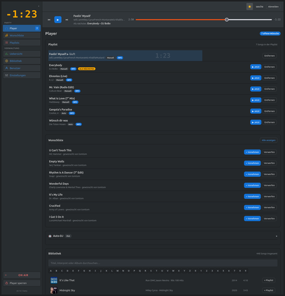
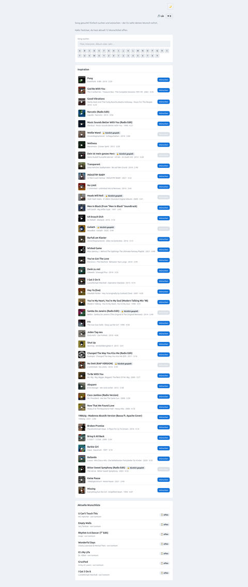
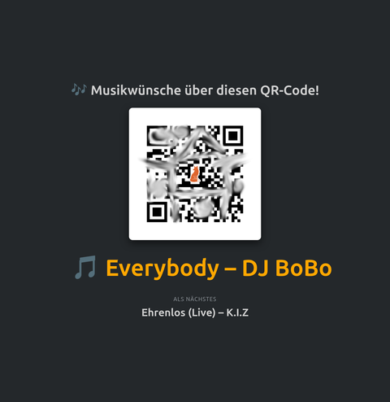

<p align="center">
  
</p>

<h1 align="center">Party Player</h1>

<p align="center">
  <b>Der Musik-Wunschzettel und Auto-DJ für deine Party - in reinem PHP, läuft auf jedem Shared-Hosting-Paket.</b>
</p>

<p align="center">
  
  
  
  
  
</p>

---

Gäste scannen einen QR-Code, wünschen sich Songs aus deiner Musikbibliothek und
sehen live, was gerade läuft und als Nächstes kommt - während du am Player die
Kontrolle behältst: annehmen, ablehnen, Auto-DJ machen lassen oder selbst
auflegen. Kein Spotify-Account, kein Cloud-Dienst, kein Docker, kein
Composer - einfach hochladen und loslegen.

<p align="center">
  <a href="assets/img/screenshots/player.png"></a>
  <a href="assets/img/screenshots/wunschliste.png"></a>
  <a href="assets/img/screenshots/display.png"></a>
</p>
<p align="center"><sub>Admin-Player · Gäste-Wunschseite · Anzeige-Bildschirm für Beamer/TV (Klick fürs volle Bild)</sub></p>

## ✨ Features

**🎧 Wiedergabe & Bibliothek**
- Spielt **MP3 und FLAC** über den integrierten HTML5-Player ab, inkl. sanftem Crossfade beim Songwechsel.
- Liest Metadaten (Titel, Interpret, Album, Cover) direkt aus ID3v1/ID3v2- bzw. FLAC-Tags.
- Mehrere Bibliotheks-Verzeichnisse gleichzeitig, jedes einzeln ein-/ausschaltbar.
- Dateien per FTP/Datei-Manager einspielen **oder** direkt im Browser hochladen, inkl. Fortschrittsanzeige.
- Bibliothek durchsuchen oder per A-Z/0-9-Sprungleiste durchscrollen - findet jeden Titel, auch ohne den genauen Namen zu kennen.

**🎉 Gäste & Wünsche**
- Eigene öffentliche Wunsch-Seite (`request.php`) - kein Account nötig. Der einmal eingegebene Name wird 24h an das Gerät gebunden (Namens-Lock).
- QR-Code direkt zur Wunsch-Seite, komplett offline im eigenen PHP-Code erzeugt (kein externer Dienst - funktioniert auch im Party-WLAN ganz ohne Internet), optional mit eigenem Logo in der Mitte.
- Wünsche annehmen oder ablehnen, dazu Herz-Reaktionen der Gäste auf den laufenden Song.

**🤖 Auto-DJ**
- Füllt die Playlist automatisch auf, sobald sie leer wird - ohne Künstler direkt zu wiederholen.
- Konfigurierbare "Kürzlich gespielt"-Sperre verhindert, dass derselbe Song zu oft hintereinander läuft.

**💾 Gespeicherte Playlists**
- Beliebig viele wiederverwendbare Sets anlegen, durchsuchen/durchscrollen (gleiche A-Z-Sprungleiste wie die Bibliothek) und per Klick komplett an die Live-Playlist anhängen.

**📡 Alles in Echtzeit**
- Admin-Oberfläche und Gäste-Seite aktualisieren sich per Server-Sent Events sofort, ganz ohne Neuladen.
- Eigene **Anzeige-Seite** (`display.php`) für Beamer/Bildschirm: großer QR-Code, laufender Ticker des aktuellen Songs, Ankündigung des nächsten Titels.

**🔒 Rollen, Fernsteuerung & Sicherheit**
- Zwei Rollen: **Admin** (voller Zugriff) und **Player** (eingeschränkt - z.B. für den Laptop direkt an der Anlage).
- Master/Slave-Fernsteuerung: mehrere gleichzeitig angemeldete Sessions steuern denselben Player fern, ohne dass die Wiedergabe doppelt läuft.
- Player-Sperre per PIN, inkl. eigener sitzungsgebundener PIN für die Player-Rolle - ganz ohne das Admin-Passwort zu kennen.
- Login-Drosselung gegen Brute-Force; `config/`, `data/` und `src/` sind per `.htaccess` gegen direkten Webzugriff gesperrt.

**🎨 Design**
- Helles und dunkles Theme, umschaltbar - basierend auf dem mitgelieferten "pan!k DaRk"-Designsystem.
- Responsive für Handy, Tablet und Desktop.

## Voraussetzungen

- PHP 8.1 oder neuer mit den Erweiterungen `pdo_sqlite` (Standard) oder
  `pdo_mysql`, plus `mbstring`, `fileinfo` (auf praktisch jedem Hoster
  vorhanden).
- Apache mit `.htaccess`-Unterstuetzung (mod_headers, mod_authz_core).
  Bei nginx muessen die `.htaccess`-Regeln (Ordner `config/`, `data/`,
  `src/` sperren) manuell als `location`-Bloecke nachgebaut werden.

## 🚀 Installation auf einem Shared Host

1. Kompletten Ordnerinhalt per FTP/SFTP/Datei-Manager in das gewuenschte
   Webverzeichnis hochladen (z.B. `public_html/` oder einen Unterordner
   davon - beides funktioniert).
2. Sicherstellen, dass die Ordner `config/` und `data/` fuer den
   Webserver-Nutzer beschreibbar sind (i.d.R. reicht der Standard, bei
   manchen Hostern `chmod 755`, notfalls `775`/`777` setzen).
3. Im Browser `https://deine-domain.tld/install.php` aufrufen und den
   zweistufigen Assistenten durchlaufen (Datenbank waehlen, erstes
   Admin-Konto anlegen).
4. Fertig - Anmeldung unter `login.php`, danach im Bereich "Bibliothek"
   ein Verzeichnis mit deiner Musik eintragen und scannen.

## Lokal testen

```bash
php -S localhost:8000
```

Danach `http://localhost:8000/install.php` oeffnen. SQLite als Datenbank
waehlen - keine weitere Einrichtung noetig.

## Bibliothek einlesen

Unter **Admin → Bibliothek** ein Verzeichnis mit dem absoluten Server-Pfad
hinterlegen (z.B. `/home/nutzername/musik`) und "Scan starten" klicken. Der
Scan laeuft in kleinen Haeppchen per AJAX aus dem Browser heraus - das
funktioniert auch bei Hostern mit strengen PHP-Ausfuehrungszeitlimits, ganz
ohne Cronjob oder SSH. Wer trotzdem automatisieren moechte: die meisten
Hoster bieten Cronjobs ganz ohne SSH ueber das Kundenmenue (z.B. cPanel) an,
darüber laesst sich `bin/scan.php` periodisch aufrufen.

## Wunsch-Seite, QR-Code & Anzeige-Bildschirm

`request.php` ist die oeffentliche Seite fuer Gaeste (kein Login noetig).
Unter **Admin → Einstellungen** gibt es einen QR-Code, der direkt dorthin
verweist - ideal zum Ausdrucken oder auf einen Bildschirm werfen. Optional
kann dort eine eigene URL (z.B. eine Subdomain wie
`wunsch.deine-domain.de`, die per DNS/Hoster-Kundenmenue auf dieses
Verzeichnis zeigt) hinterlegt werden; ohne Eintrag wird die in
`config/config.php` hinterlegte `app_url` verwendet.

Fuer einen Beamer oder Bildschirm neben der Anlage gibt es zusaetzlich
`display.php`: eine rein passive Seite mit grossem QR-Code, laufendem
Ticker des aktuellen Songs und Ankuendigung des naechsten Titels -
aktualisiert sich live per Server-Sent Events, ganz ohne Bedienung.

## Architektur-Hinweise

- Wiedergabe laeuft bewusst nur im Admin-Bereich (`player.php`) - das ist
  der Rechner/Tablet an der Anlage. Gaeste hoeren nicht im Browser mit,
  sondern wuenschen nur.
- Keine Abhaengigkeiten ausserhalb des PHP-Standardumfangs: kein Composer,
  keine `vendor/`-Ordner. Metadaten-Parsing (ID3/FLAC) und der QR-Code sind
  bewusst selbst geschrieben, um auf jedem Shared Host ohne Zusatzschritte
  lauffaehig zu sein.
- `config/`, `data/` und `src/` sind per `.htaccess` gegen direkten
  Webzugriff gesperrt.

## Ordnerstruktur

```
├── install.php          Web-Installer (einmalig)
├── login.php / logout.php
├── index.php              Einstiegspunkt, leitet weiter
├── player.php             Admin-Player (Bibliothek + Wiedergabe)
├── request.php            Oeffentliche Gaeste-Wunsch-Seite
├── display.php            Passive Anzeige-Seite fuer Beamer/Bildschirm
├── admin/                 Verwaltung (Uebersicht, Bibliothek, Playlists, Wunschliste, Nutzer, Einstellungen)
├── api/                   JSON-/Stream-Endpunkte fuer das Frontend
├── assets/                CSS (inkl. panikdark.css) und JS
├── bin/scan.php           Optionaler CLI-Scan fuer Cronjobs
├── config/                config.php (nach Installation), per .htaccess gesperrt
├── data/                  SQLite-Datei + Scan-Zwischenstand, per .htaccess gesperrt
├── src/                   PHP-Klassen (Datenbank, Auth, Scanner, Metadaten, QR-Code, ...)
└── templates/             Header/Footer-Partials fuer Admin- und Gaeste-Seiten
```

## Lizenz

Party Player steht unter der [GNU Affero General Public License v3.0](LICENSE). Kurz gesagt: frei nutzbar, veränderbar und weitergebbar - wer eine veränderte Version öffentlich (auch nur als gehosteten Dienst für Gäste) betreibt, muss den dazugehörigen Quellcode ebenfalls zur Verfügung stellen.
